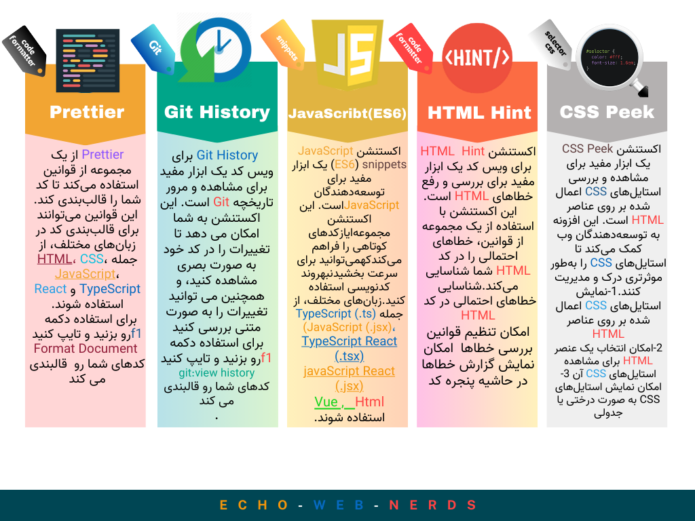
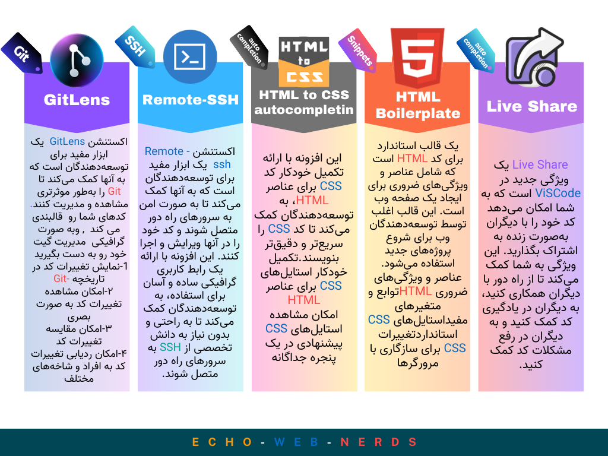
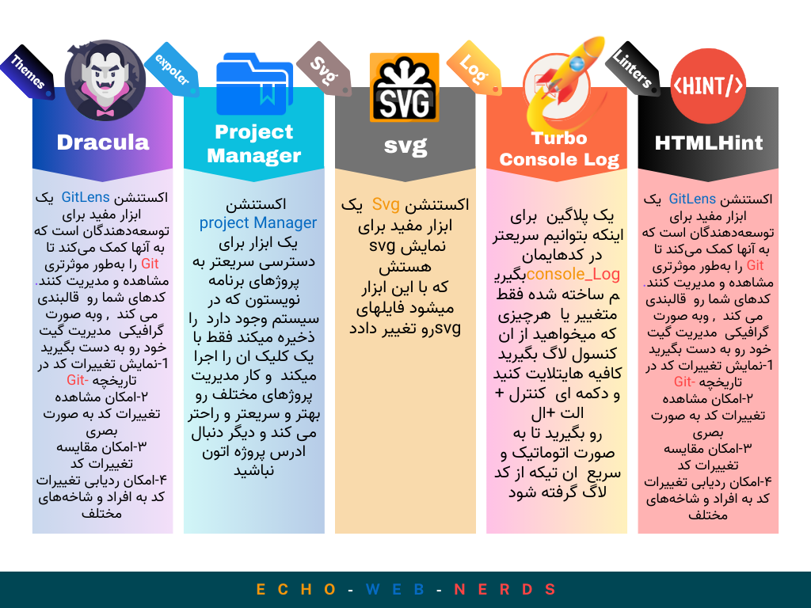
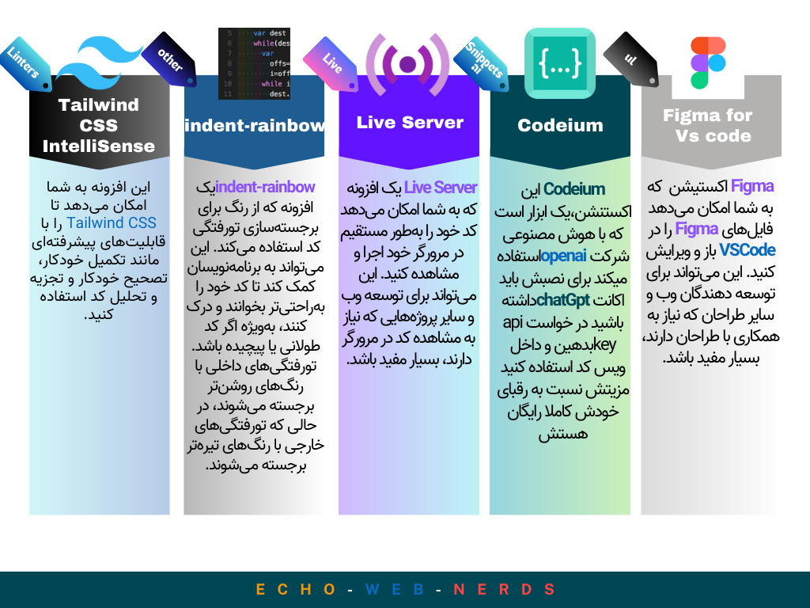
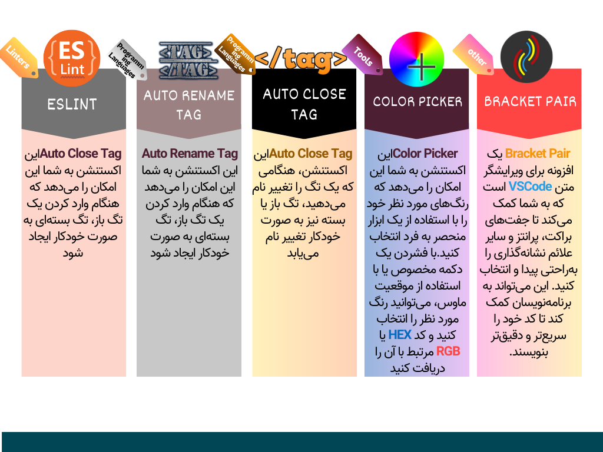
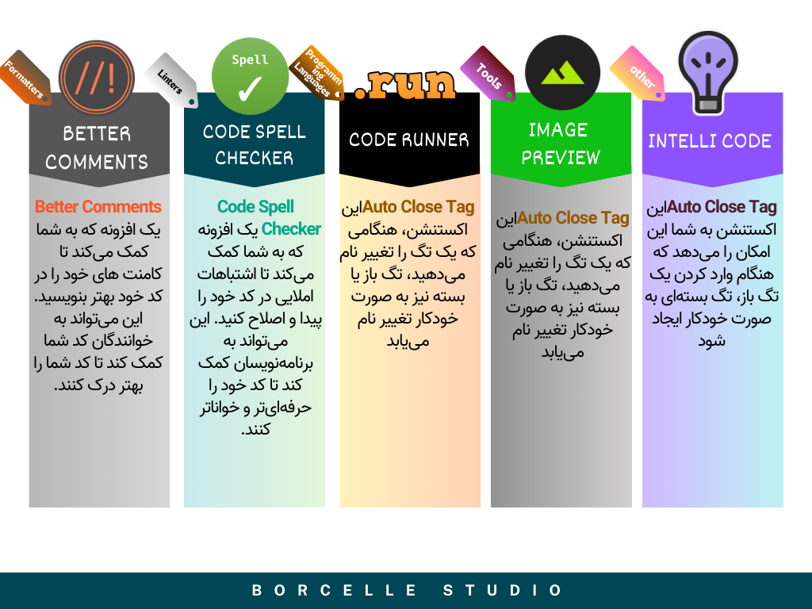

# 📦 front-end-extension-gold-pack  
### A Complete and Powerful Package for Front-End Developers 🥇
🏴󠁧󠁢󠁥󠁮󠁧󠁿 <a href="#English">English</a> 🇮🇷 <a href="#persian">persian</a> 
## English
**
 Front-End Extension Gold Pack is a complete and powerful Package of VS Code extensions designed for front-end developers. This Package includes a collection of essential and useful extensions for coding, formatting, project management, and more. 
**
### Extensions included in this Package are:

1- [**Prettier**](https://marketplace.visualstudio.com/items?itemName=esbenp.prettier-vscode)  for formatting code in a consistent and beautiful way  
2- [**JavaScript (ES6) code snippets** ](https://marketplace.visualstudio.com/items?itemName=xabikos.JavaScriptSnippets)JavaScriptSnippets for quick and easy access to repetitive JavaScript code  
3- [**HTMLHint**](https://marketplace.visualstudio.com/items?itemName=HTMLHint.vscode-htmlhint) for checking HTML code and suggesting corrections  
4- [**CSS Peek**](https://marketplace.visualstudio.com/items?itemName=pranaygp.vscode-css-peek) for viewing the CSS code underneath any HTML element  
5- [**GitHistory**](https://marketplace.visualstudio.com/items?itemName=donjayamanne.githistory) for exploring code history and changes made  
6- [**Import Cost**](https://marketplace.visualstudio.com/items?itemName=wix.vscode-import-cost) for estimating the cost of importing npm packages  
7- [**Remote SSH**](https://marketplace.visualstudio.com/items?itemName=ms-vscode-remote.remote-ssh) for accessing your code via SSH  
8- [**HTML Snippets**](https://marketplace.visualstudio.com/items?itemName=abusaidm.html-snippets) for quick and easy access to repetitive HTML code  
9- [**HTML-CSS**](https://marketplace.visualstudio.com/items?itemName=solnurkarim.html-to-css-autocompletion) for automatic completion of HTML and CSS code  
10- [**HTML-CSS Class Completion**](https://marketplace.visualstudio.com/items?itemName=Zignd.html-css-class-completion) for automatic completion of HTML and CSS classes  
11- [**LiveShare**](https://marketplace.visualstudio.com/items?itemName=MS-vsliveshare.vsliveshare) for sharing code in real time with other developers  
12- [**Theme-Dracula**](https://marketplace.visualstudio.com/items?itemName=dracula-theme.theme-dracula) for beautifying the VS Code workspace  
13- [**Project Manager**](https://marketplace.visualstudio.com/items?itemName=alefragnani.project-manager) for managing front-end projects  
14- [**SVG**](https://marketplace.visualstudio.com/items?itemName=jock.svg) for working with SVG files  
15- [**Turbo Console Log**](https://marketplace.visualstudio.com/items?itemName=ChakrounAnas.turbo-console-log) for improving the performance of console output  
16- [**Tailwind CSS**](https://marketplace.visualstudio.com/items?itemName=bradlc.vscode-tailwindcss) for using Tailwind CSS in VS Code  
17- [**Indent Rainbow**](https://marketplace.visualstudio.com/items?itemName=oderwat.indent-rainbow) for coloring code based on indentation level  
18- [**LiveServer**](https://marketplace.visualstudio.com/items?itemName=ritwickdey.LiveServer) for launching a local server for testing code  
19- [**Codeium**](https://marketplace.visualstudio.com/items?itemName=Codeium.codeium) for creating interactive code samples  
20- [**Intellicode-API-Usage-Examples**](https://marketplace.visualstudio.com/items?itemName=VisualStudioExptTeam.intellicode-api-usage-examples) for viewing examples of API usage  
21- [**Gutter Preview**](https://marketplace.visualstudio.com/items?itemName=kisstkondoros.vscode-gutter-preview) for previewing code changes in the margin  
22- [**Code Runner**](https://marketplace.visualstudio.com/items?itemName=formulahendry.code-runner) for running JavaScript, CSS, and HTML code  
23- [**Code Spell Checker**](https://marketplace.visualstudio.com/items?itemName=streetsidesoftware.code-spell-checker) for checking code spelling  
24- [**Better Comments**](https://marketplace.visualstudio.com/items?itemName=aaron-bond.better-comments) for improving the quality and readability of code comments  
25- [**Bracket Pair Color DLW**](https://marketplace.visualstudio.com/items?itemName=CoenraadS.bracket-pair-colorizer-2) for coloring paired brackets  
26- [**VSCode-Color**](https://marketplace.visualstudio.com/items?itemName=anseki.vscode-color) for using custom colors in VS Code  
27- [**Auto-Close Tag**](https://marketplace.visualstudio.com/items?itemName=formulahendry.auto-close-tag)for automatically closing tags  
28- [**Auto-Rename Tag**](https://marketplace.visualstudio.com/items?itemName=formulahendry.auto-rename-tag) for automatically renaming tags  
29- [**VSCode-ESLint**](https://marketplace.visualstudio.com/items?itemName=formulahendry.auto-rename-tag) for linting code using ESLint  
30- [**Figma-VSCode-Extension**](https://marketplace.visualstudio.com/items?itemName=figma.figma-vscode-extension) for using Figma in VS Code  
  
Front-End Extension Gold Pack is a valuable tool for front-end developers that can help them increase productivity and improve code quality. This Package is available for free in the VS Code Marketplace.

<h1>Some of the benefits of using Front-End Extension Gold Pack include:</h1>

<h3>1- Increased productivity:</h3> This Package includes a collection of essential and useful extensions that can help developers save time and increase productivity. 
<h3>2- Improved code quality: </h3>This Package includes extensions for formatting, linting, and more that can help developers improve the quality of their code. 
<h3>3- Compatibility with the latest technologies: </h3>This Package is regularly updated to ensure compatibility with the latest technologies. 
If you are a front-end developer, Front-End Extension Gold Pack is a valuable tool for you. This Package can help you code faster, easier, and with better quality.
## persian

* 

[@echoWebNerds](https://github.com/echoWebNerds)
[@mohmmadView](https://github.com/mohmmadView/)
[@Minoo zarpoosh](https://github.com/Zarpoosh)
**Enjoy!**

